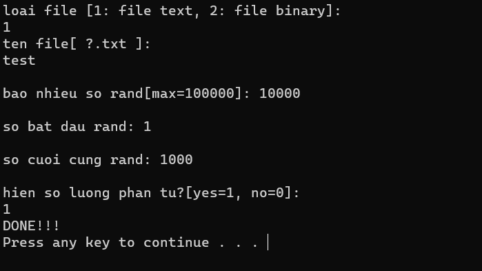
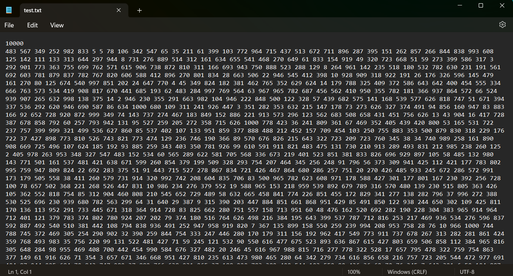
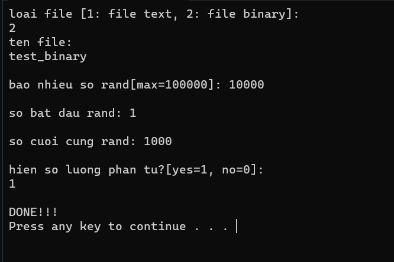
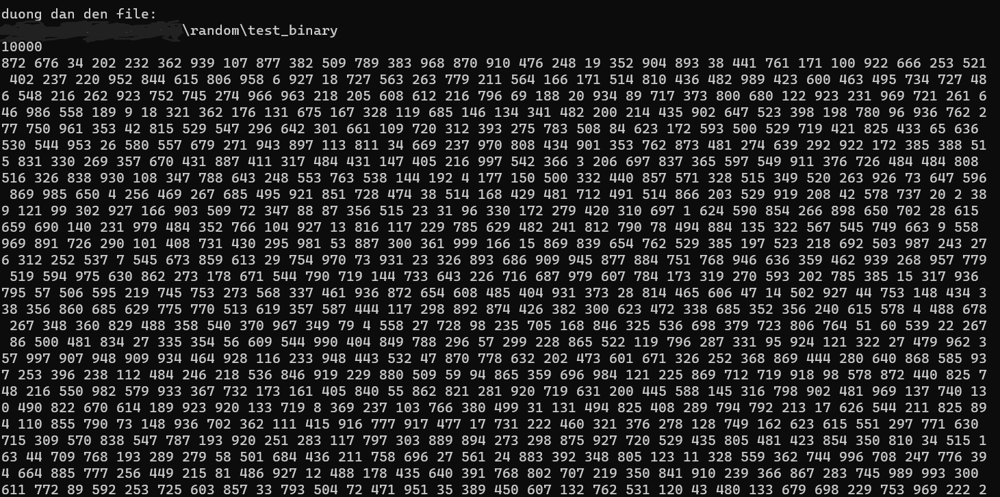

# Tạo file ramdom số (file text hoặc binary)


 

## Tác giả

| STT |    MSSV    | Họ và tên             |
| :-: | :--------: | --------------------- |
|  1  | 3119410439 | Minh Hiếu Calan Tog   |


## Hướng dẫn cài đặt

```
1. Chạy file "rand.exe" để random số.

```

```
2. Nếu là file binary, sau khi random xong, muốn đọc được file cần chạy file "doc_file_binary.exe"
```

## Một số giao diện của chương trình






